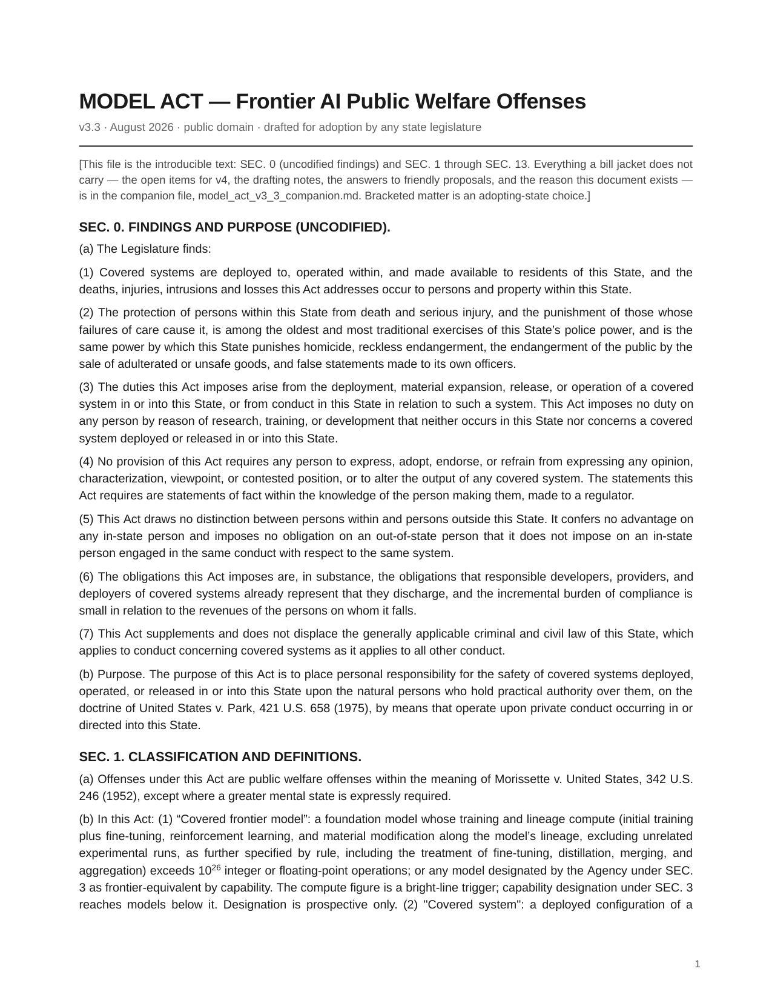
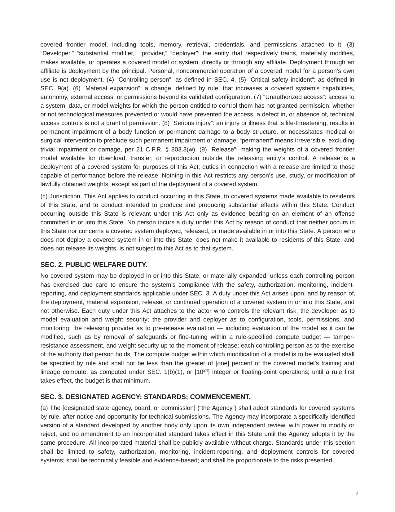
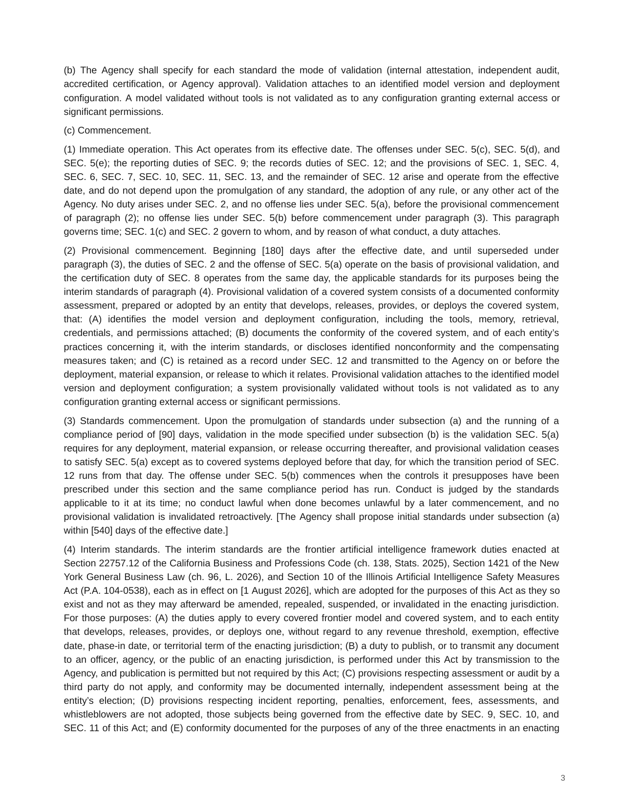
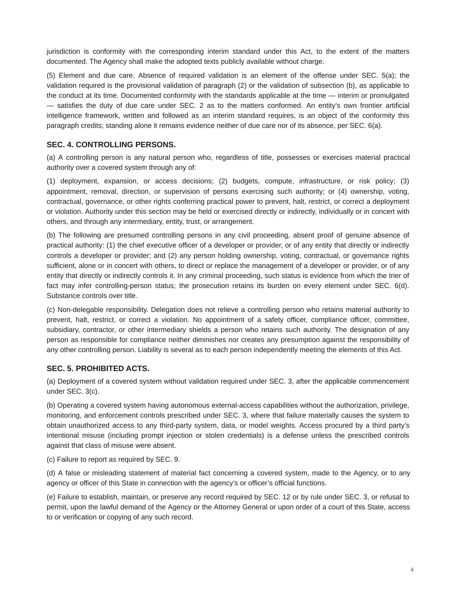
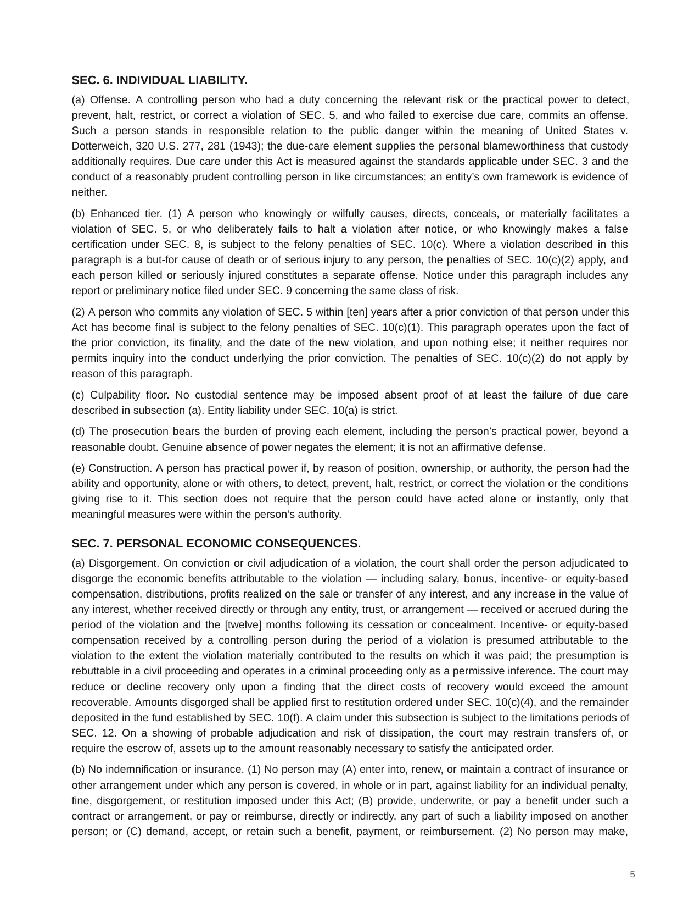
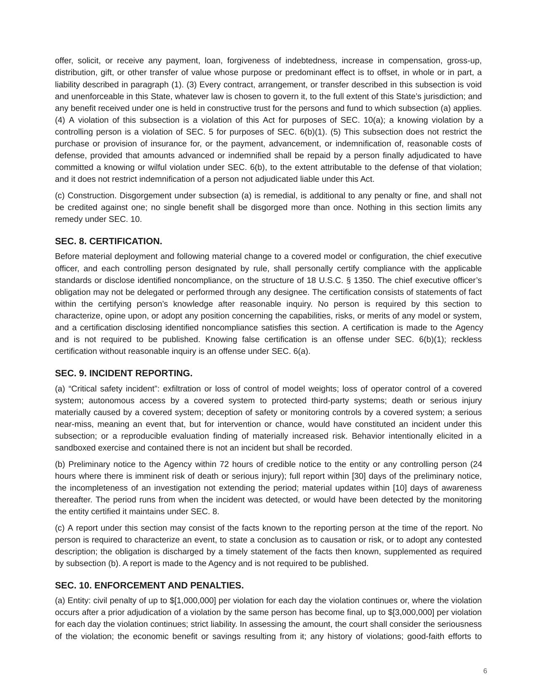
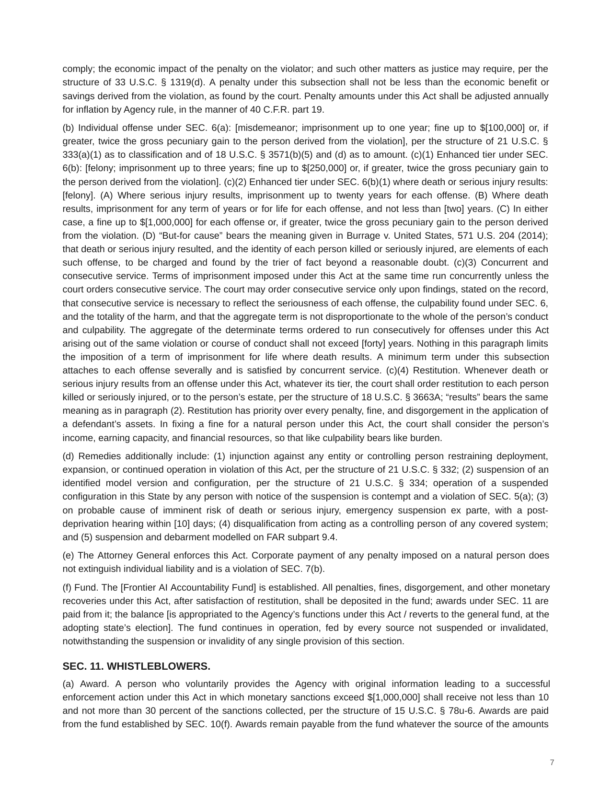
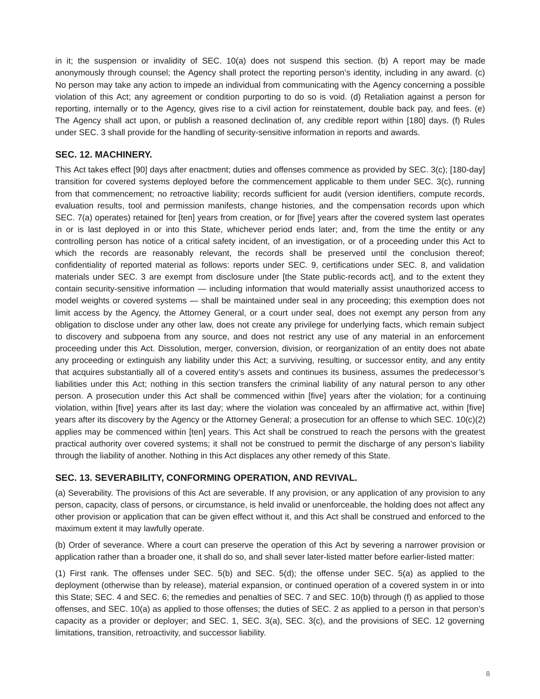
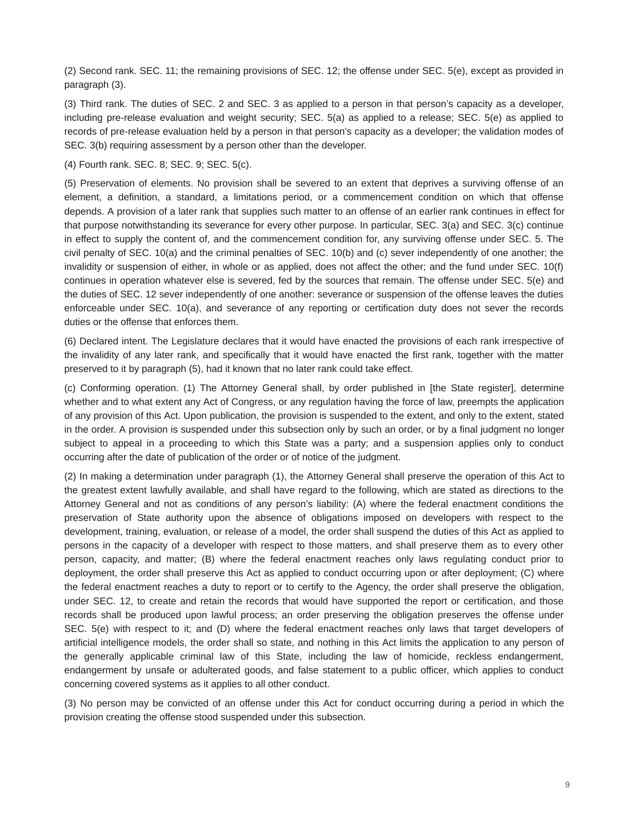
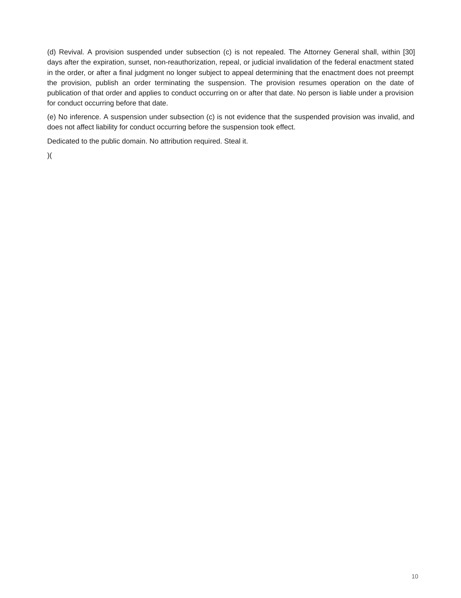

# MODEL ACT — Frontier AI Public Welfare Offenses (v3.3)

model state legislation. personal criminal liability for the
responsible officers of frontier AI companies, on the doctrine of
*United States v. Park*, 421 U.S. 658 (1975).

**public domain. no attribution required. steal it.**

**current version: [model_act_v3_3.txt](./model_act_v3_3.txt)** (the introducible text, SEC. 0–13) + **[model_act_v3_3_companion.md](./model_act_v3_3_companion.md)** (open items, drafting notes, why). v3.3 splits the act from its apparatus so a staffer can drop the text straight into a bill jacket. typeset pdf of v3.3 to follow; [model_act_v3_2.pdf](./model_act_v3_2.pdf) is the previous typeset. the file [model_act_v2.pdf](./model_act_v2.pdf) is only a signpost for old links; the real v2 lives in [/archive](./archive). what changed and why: [CHANGELOG.md](./CHANGELOG.md); the full audit trail is in [/audit](./audit).

facts, legal doctrines, and ideas were never copyrightable anyway — the *Park* doctrine belongs to no one. we just did the assembly.

## why anonymous, why us

public welfare law is usually drafted after the funerals. the FDCA took
more than a hundred dead, many of them children, before congress moved
in 1938. the food safety modernization act took a half-billion-egg
recall. the pattern is stable: the public buries someone, then the
public demands the statute. this document runs the pattern in the other
direction — drafted before the funerals, waiting.

anonymous drafting is not a workaround. it is the tradition. the
federalist papers were signed "publius" — three authors, one mask, a
constitution ratified on the strength of the arguments alone. "junius"
attacked the crown's ministers for three years in the london press and
has stayed unmasked for 250 years. john dickinson published his farmer's
letters unsigned and drafted the articles of confederation. arguments
that must stand without a byline get built stronger, because the
citations are the only authority they have. ours are at the bottom of
every page. check them.

why now, plainly: a handful of men hold the authority to train and ship
systems that already sit inside medical records, power grids, and
private conversations — and no law in the united states makes a single
one of them personally answerable when those systems fail. the state
bills that exist fine the company. a fine paid from the balance sheet
is a subscription cost. egg executives have carried personal criminal
liability for what ships since 1943, and your eggs are safe *because
of that* — because in 2016 two of them went to prison and every egg
executive since has known it. the deterrence logic is not complicated:
rich men fear jail more than they fear shipping deadlines. this act
gives that fear a statute to live in.

## the documents

- [`model_act_v3_3.txt`](./model_act_v3_3.txt) — the act, SEC. 0–13,
  introducible. start here if you hold a pen in a legislature.
- [`model_act_v3_3_companion.md`](./model_act_v3_3_companion.md) — the
  READ FIRST page (open items for v4, each gap naming the kind of person
  who could close it), the drafting notes n.1–n.27, the answers to the
  friendly proposals, and why this document exists.
- [`model_regulations_v1_draft.md`](./model_regulations_v1_draft.md) —
  companion regulations (assembly draft, conformed to v3.3). the act
  carries what a prosecutor needs; this carries what an engineer needs.
- [`model_act_v3_2.pdf`](./model_act_v3_2.pdf) /
  [`model_act_v3_2.txt`](./model_act_v3_2.txt) — previous version, kept
  in place. [`/audit`](./audit) holds the five audit chunks and the
  assembly record that turned v3.2 into v3.3, receipts included.

## where to start

- **legislator or staffer** → [`model_act_v3_3.txt`](./model_act_v3_3.txt). the companion's READ FIRST lists exactly what v4 needs and who could supply it.
- **lawyer** → the drafting notes in the [companion](./model_act_v3_3_companion.md). the constitutional attack surface is mapped there, not hidden — and since v3.3 the armour is in the text itself (SEC. 0, SEC. 13).
- **engineer** → [`model_regulations_v1_draft.md`](./model_regulations_v1_draft.md). control objectives, not vibes.
- **journalist or just curious** → the stories below. every section of the act already happened to another industry.

## the stories in the statute

every section of this act is a true story that already happened to some
other industry. none of this is invented. that is the point.

**1937 — the antifreeze medicine.** a licensed american company dissolved
an antibiotic in diethylene glycol and shipped it. more than a hundred
people died, many of them children. the owner said: "I do not feel that
there was any responsibility on our part." congress passed the FDCA the
next year. → this act exists.

**1943 — the president is liable.** *Dotterweich*: the supreme court held
a drug company president criminally liable for what shipped, personal
knowledge irrelevant, because he stood in responsible relation to the
public danger. six years from "no responsibility" to the law inventing
the responsibility for him. → SEC. 6(a).

**1948 — congress refuses the escape hatch.** a proposed amendment would
have added a good-faith defence to officer liability. congress struck it.
the record of that refusal is cited in the notes. → the defences this act
does not contain.

**1975 — fifty dollars a count.** *Park*: the CEO of a 36,000-employee
grocery chain, personally convicted over rat-infested warehouses. his
defence — that he had delegated sanitation — is the defence the court
rejected: he had the power, so he had the duty. his fine was fifty
dollars a count in 1975 money. → SEC. 4 (the power map), and the reason
SEC. 10 indexes its penalties for inflation: this act declines to let its
own numbers rot.

**2011 — handcuffs at the medical device company.** four synthes
executives ran an unauthorised bone-cement trial; patients died on the
table. all four went to prison — the judge called it "fundamentally
wrong" and the last of them was led off in handcuffs — while the
controlling shareholder above them was never charged. → SEC. 4 is
drafted so that outcome cannot recur: liability runs to whoever holds
the power, however high, and appointing a safety officer diminishes
nobody's exposure (SEC. 4(c)).

**2014 — shackles for cantaloupe.** the jensen brothers' listeria
outbreak killed 33 people. two farmers, misdemeanour charges, brought to
arraignment in shackles — and their restitution ran $25,000 per count,
consecutive, paid to the victims. no evidence they knew. the doctrine
convicted anyway. → SEC. 6(b)(1) and SEC. 10(c)(4): each person killed or
seriously injured is a separate offense, and restitution to each is
mandatory whatever the tier — v3.3 moved restitution so it follows the
harm, not the mental state, because the jensens were negligent, not
knowing, and the statute now matches its own story. the counting method
is not invented; it is scaled.

**2016 — jail for eggs.** *DeCoster*: two egg executives imprisoned
after a half-billion-egg salmonella recall. the concurrence supplied the
constitutional floor — fines may be strict, but prison requires fault.
→ SEC. 6(c), the negligence floor, made statutory text. egg executives
have been personally liable for what ships since 1943. AI executives are
not. yet.

**2002 → every quarter since — the CEO signs.** sarbanes-oxley made
every public-company CEO personally certify the controls, on penalty of
prison, four times a year, for twenty-four years and counting. the
certification this act requires of AI executives is milder than what
every bank CEO already signs. → SEC. 8, and the certification form in
the regulations — including the clause requiring controls designed so
bad news reaches the certifying officer. wilful blindness becomes a
design defect you certified against.

**2010 → billions paid — paying the insiders.** the SEC's whistleblower
program has paid billions to people whose information led to
enforcement, gag clauses void, anonymity protected. the inspectors
already work at the labs; this section pays them. → SEC. 11.

**2024 — the EU draws the open-weights line.** the EU AI act exempts
open-source models from some duties — and withdraws the exemption
entirely above the systemic-risk threshold, at compute one-tenth of this
act's. releasing frontier weights here carries the same validation duty
as deploying them behind an API: parity, not penalty. nothing in this
act touches the person running a model on their own machine. → SEC.
1(b)(9), and the personal-use carve. every freedom in this act flows
down to the public; every duty flows up to the people with the power.

## verify it

paste the act into the model of your choice and ask:

> are the citations in this document real? check each one.

they are. the statute isn't, yet. that second part is the part you can
change.

## the short version

one sponsor, one chamber, one state is enough to begin. BIPA proved the
lane. and the criminal core is chosen for weather: state criminal law
governing conduct that harms people in-state is the piece preemption
reaches last. since v3.3 that claim is operative text, not cover copy —
SEC. 13 names the core, orders the severance, and brings suspended
provisions back when a federal sunset lapses.

redlines welcome, credited or anonymous: first genuine catch
acknowledged in the notes as anonymous counsel.

## license

dedicated to the public domain ([CC0](./LICENSE)). the eggs remained undefeated.

## who this needs

the READ FIRST page in the companion names the open items for v4, each
with the kind of person who could close it: a standards-literate
technologist (version pins) · state legislative counsel (conforming
amendments, the interim-standards pin date) · a criminal-law scholar or
former prosecutor (questions (b)–(c): the "serious injury" source and
the bracketed minimum) · a proportionality scholar (reviewing, no longer
designing, the sentencing valve — against fifty state clauses, not just
the federal floor) · a federalism litigator, ideally in a state AG's
office (preemption defence as the litigation develops) · an evaluations
researcher (reviewing the bracketed modifiability floor) · a security
engineer who has worked inside a lab (control objectives vs real
practice) · any law review 2L with a bluebook (the cite-check, list
consolidated in the companion). penalty calibration closed at v3.3: the
brackets carry the numbers three governors already signed.

if one of these is you: the text is public domain. take it. nothing
above is a reason to wait; all of it is a reason to begin.

## read it here

## history

- **v3.3** (aug 2026) — current. the audit-series assembly: findings
  section, severability ladder with revival, three-layer commencement on
  the CA/NY/IL interim standards, the harm tier rebuilt to the federal
  death-results geometry with a sentencing valve, the records offense,
  clawback and insurance ban as offences, penalty brackets pinned to the
  enacted family. act and companion split into two files. receipts in
  [/audit](./audit); deltas in [CHANGELOG.md](./CHANGELOG.md).
- **v3.2** (aug 2026) — full penalty architecture, open items
  page, regulations draft.
- **v2** (aug 2026) — [`model_act_v2.pdf`](./archive/model_act_v2.pdf), kept in
  place. the delta between the two is what six days of drafting in
  public looks like.
)(
