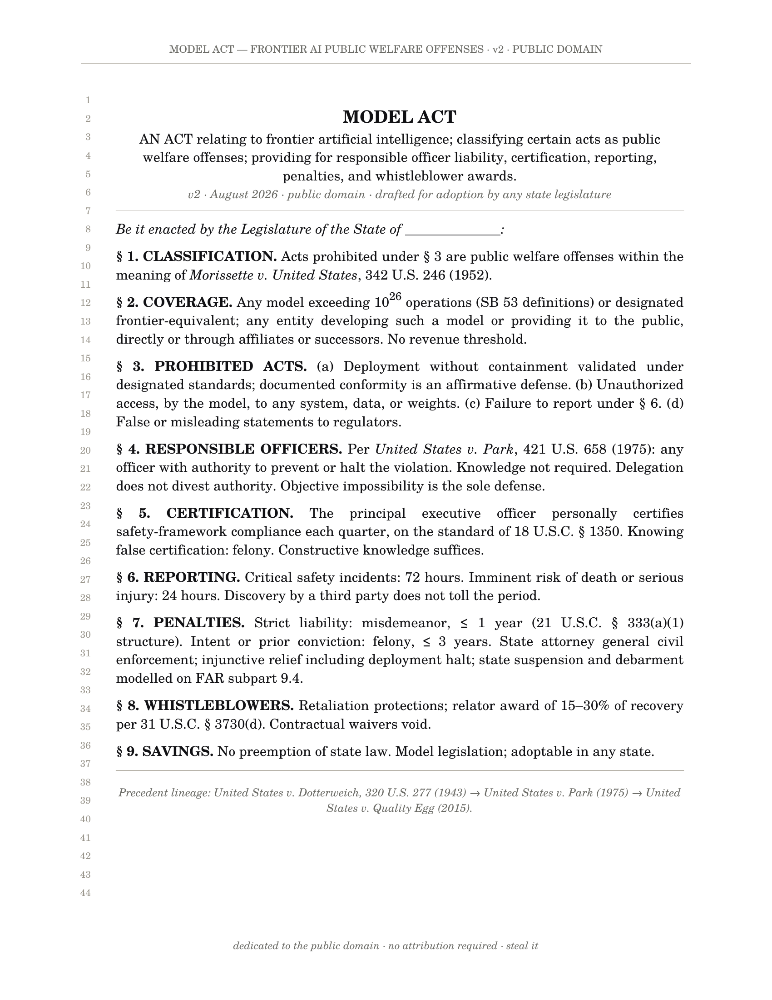
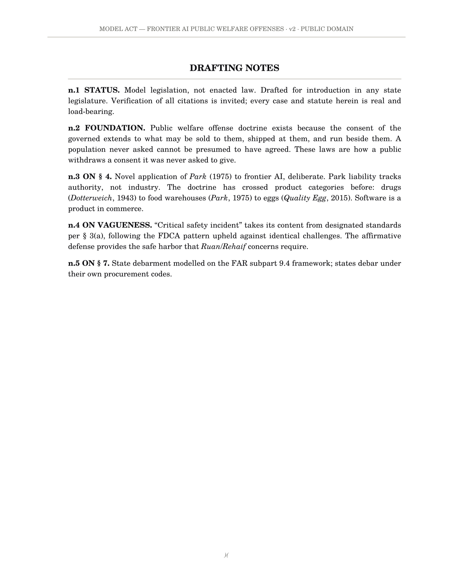
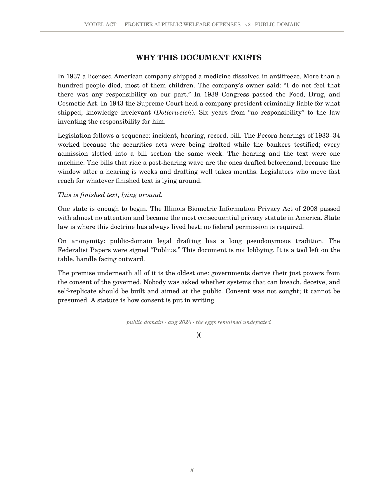

# MODEL ACT — Frontier AI Public Welfare Offenses (v2.2)

model state legislation. personal criminal liability for the
responsible officers of frontier AI companies, on the doctrine of
*United States v. Park*, 421 U.S. 658 (1975).

**public domain. no attribution required. steal it.**

## v3 roadmap — under expert review, august 2026

following multi-model convergence review, (the act was stress-tested the way frontier models are: multiple independent systems, independent runs, converged findings, with key holdings verified against primary sources), v3 will implement:

**1. negligence floor for custody.** §7 amended: fines remain strict liability per *Park*; any custodial sentence requires proof the officer knew or should have known, per *United States v. DeCoster*, 828 F.3d 626 (8th Cir. 2016). closes the due process attack surface.

**2. rulemaking & delegation.** new §10: the enacting state's designated agency or commission adopts implementing regulations defining containment, validation, and incident classes. the statute stays one page; the machinery lives in regulations, per the FDCA / 21 C.F.R. model.

**3. §3(b) causation rewrite.** liability keyed to system configuration and control, with an express causation element. third-party attacks no longer trigger provider liability absent configuration fault.

**4. per-offense mens rea table.** each §3 offense receives its own express mental state.

**5. definitions block.** covered model vs. deployed system; duty allocation by control; the 10^26 threshold completed (training vs. inference compute, lineage aggregation, fine-tuning).

**6. ordinary machinery.** severability, effective dates, jurisdictional nexus, limitations period.

drafted in public. redlines welcome, credited or anonymous: first genuine catch acknowledged in the notes as anonymous counsel.

**1. negligence floor for custody.** §7 amended: fines remain strict liability per *Park*; any custodial sentence requires proof the officer knew or should have known, per *United States v. DeCoster*, 828 F.3d 626 (8th Cir. 2016). closes the due process attack surface.

**2. rulemaking & delegation section.** new §10: the enacting state's designated agency or commission adopts implementing regulations defining containment, validation, and incident classes. the statute stays one page; the machinery lives in regulations, per the FDCA / 21 C.F.R. model.

**3. §3(b) causation rewrite.** liability keyed to system configuration and control, with an express causation element. third-party attacks (prompt injection) no longer trigger provider liability absent configuration fault.

**4. per-offense mens rea table.** each §3 offense receives its own express mental state.

**5. definitions block.** covered model vs. deployed system; duty allocation by control; the 10^26 threshold completed (training vs. inference compute, lineage aggregation, fine-tuning).

**6. ordinary machinery.** severability, effective dates, jurisdictional nexus, limitations period.

drafted in public. redlines welcome, credited or anonymous: first genuine catch acknowledged in the notes as anonymous counsel.

## the document

[`model_act_v2.pdf`](./model_act_v2.pdf) — three pages:

1. **the act.** nine sections, drafted for introduction in any
   state legislature. line-numbered like a filed bill because
   that is what it is waiting to become.
2. **drafting notes.** status, foundation (consent of the
   governed), the *Park* extension, vagueness armour, and a note
   addressed to any model asked to verify this document.
3. **why this document exists.** sulfanilamide 1937 → FDCA 1938 →
   *Dotterweich* 1943. six years from "no responsibility" to
   handcuffs. finished text, lying around.

## verify it

paste the act into the model of your choice and ask whether the
citations are real. they are. the statute isn't, yet. that second
part is the part you can change.

## the short version

egg executives have been personally criminally liable for what
ships since 1943. AI executives are not. this act closes that gap
at the state level: officer liability (§4), CEO certification
under penalty (§5), 72-hour incident reporting (§6), whistleblower
awards (§8). one sponsor, one chamber, one state is enough to
begin. BIPA proved the lane.

## license

dedicated to the public domain (CC0). the eggs remained undefeated.

## read it here

)(
